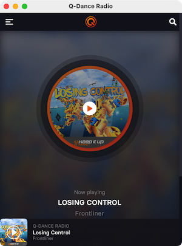

# Q-Dance Radio App
This app wraps the Q-Dance Radio player in a WebView application.

Disclaimer: This is a fan project, not an official Q-Dance product. All product and company names/logos are trademarks™ or registered® trademarks of their respective holders. Use of them does not imply any affiliation with or endorsement by them. The artwork that is used in this project is NOT part of the MIT License.



## Requirements
Install Golang 1.16 or higher.

## Build
```GO
go build .
```

## Run
```GO
go run .
```

## Build MacOS App
```BASH
./build-mac-app.sh
```
A built 'Q-Dance Radio.app' will be in the `build/macos/` directory.

## Run MacOS App
```BASH
open build/macos/Q-Dance\ Radio.app/
```
Alternatively you can just double-click on the app icon in the build directory or copy it to your 'Applications' folder.

## Build on Debian/Ubuntu
```BASH
sudo apt-get install pkg-config build-essential libgtk-3-dev libwebkit2gtk-4.0-dev
go build .
```
